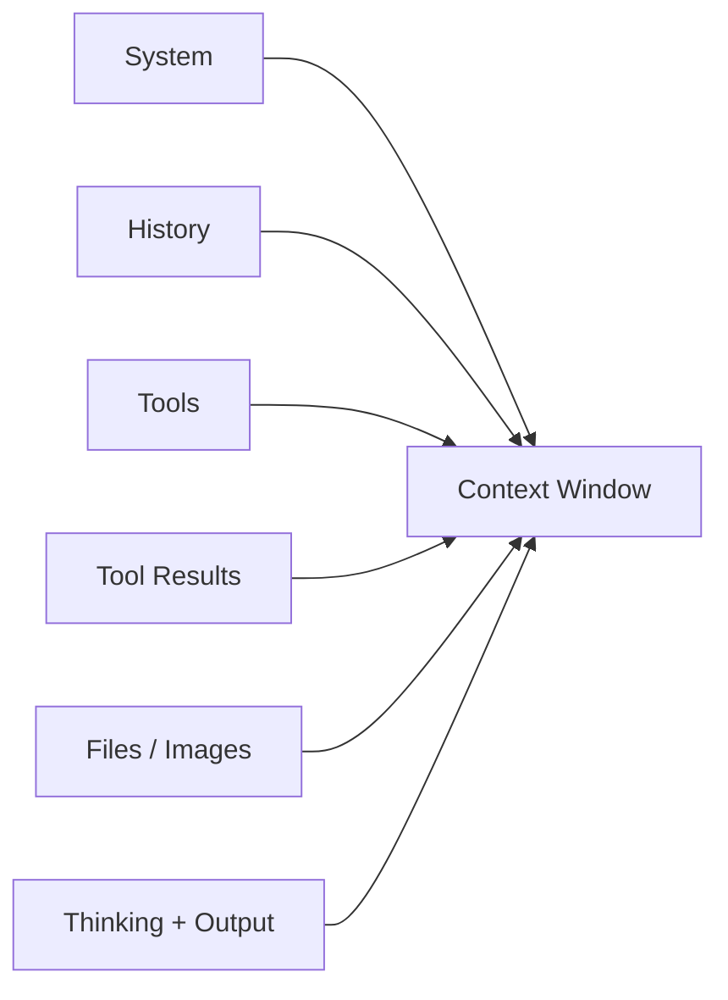
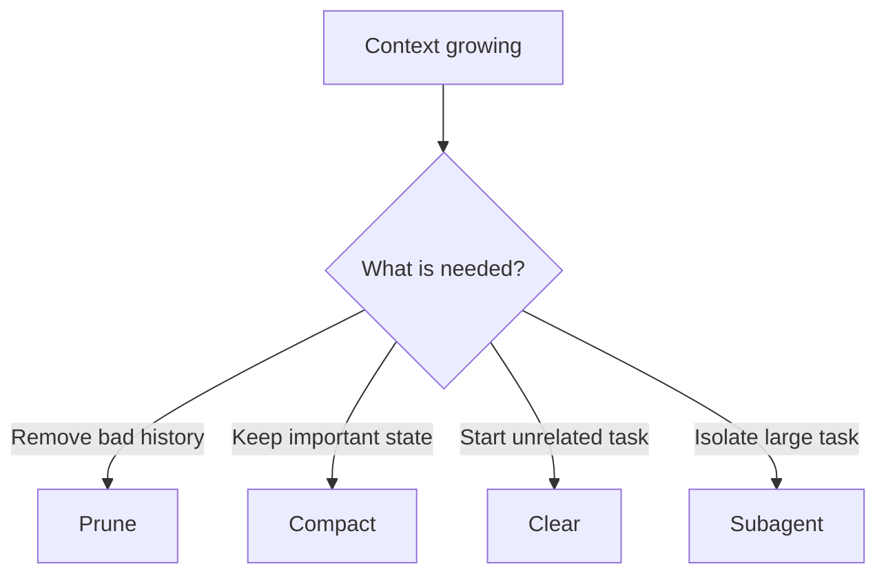
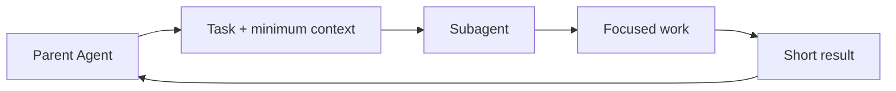
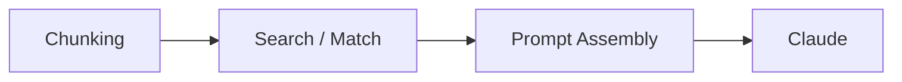
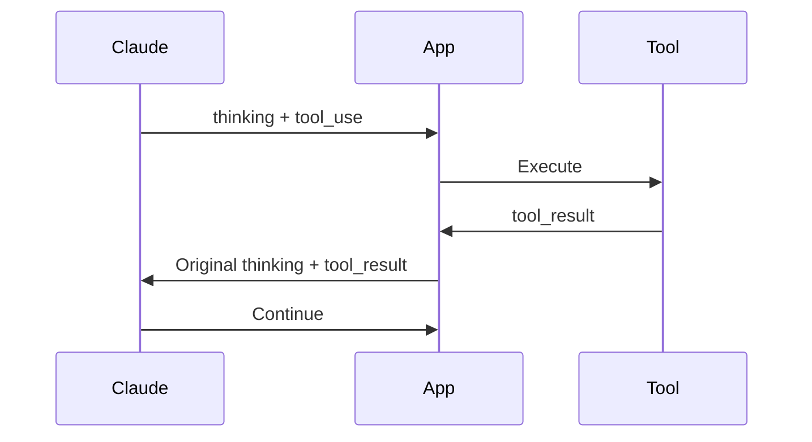
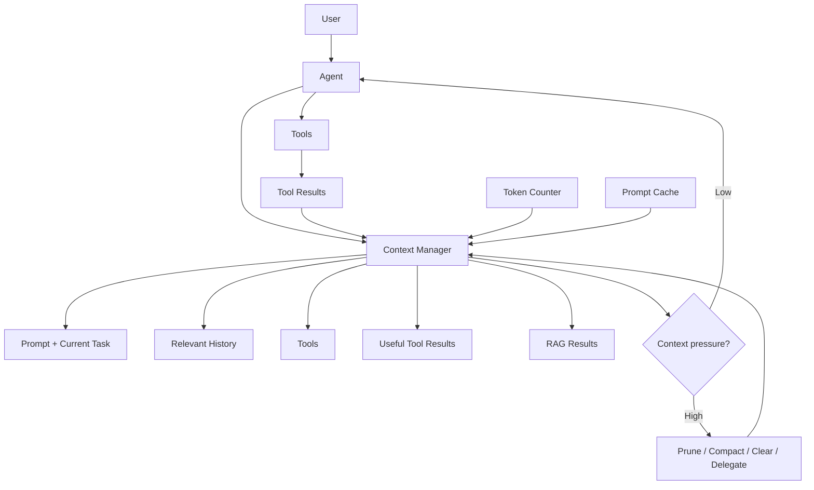
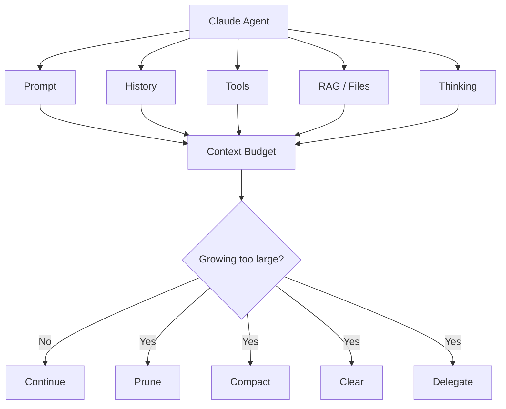

# Claude Context Engineering — Quick Revision

> **Core idea:** Context is Claude's working memory. Good context engineering means keeping the **right information**, not simply adding more.

## 1. What Uses Context?

- System prompt
- User and assistant messages
- Conversation history
- Tool definitions
- Tool calls and results
- Images and documents
- Extended thinking
- Claude's generated output



**More context is not always better.** Very large contexts can reduce recall and accuracy (**context rot**).

---

## 2. Context Window = Budget

```text
┌──────────────────────────────────┐
│          CONTEXT WINDOW          │
│                                  │
│ Prompt + History + Tools + Data │
│ + Thinking + Output             │
│                                  │
│              LIMIT               │
└──────────────────────────────────┘
```

- Every turn can add tokens.
- Tool results remain in the conversation unless managed.
- Long-running agents can fill the window quickly.
- A larger context limit does **not** remove the need for context management.

### Current model limits

| Model group | Context window |
|---|---:|
| Current supported 1M-context models | **1M tokens** |
| Other models such as Sonnet 4.5 | **200K tokens** |

- Some models can generate up to **128K output tokens** in one request.
- Image/PDF limits can be reached before the token limit.
- Always verify current model capabilities before implementation.

---

# 3. Development vs Production

Production data is often much larger than test fixtures.

### Example

| | Development | Production |
|---|---:|---:|
| Team context budget | 40K | 40K |
| Avg. tool result | ~800 tokens | ~3,200 tokens |
| Result | Completes | Hits budget around turn 8 |
| Symptom | None | Wrong tools / incomplete answers |
| Root cause | — | Context filled with old tool output |

The model's context limit did not change; the **amount consumed per turn did**.

```text
Small fixtures → many turns
Large production results → few turns
```

> If behavior starts degrading after a predictable number of turns, **check context usage before debugging tools or prompts**.

---

# 4. Four Context Management Strategies

| Strategy | Meaning | Best use | What you lose |
|---|---|---|---|
| **Pruning** | Go back to an earlier point and discard later turns | Wrong/noisy path | Work after rewind |
| **Compaction** | Replace old history with a summary | Continue the same task | Details not preserved |
| **Clearing** | Start a fresh conversation | Unrelated task | Entire old context |
| **Subagent handoff** | Move a focused task into another context | Large self-contained work | Detailed intermediate steps |



---

## 5. Pruning

**Pruning = rewind.**

Use when:

- The agent followed a bad path.
- Debugging back-and-forth is no longer useful.
- Recent context is mostly noise.

```text
A → B → C → D → E
        ↑
      rewind
        ↓
A → B → C → new work
```

**Trade-off:** useful discoveries after the rewind are also removed.

---

## 6. Compaction

**Compaction = replace a long history with a shorter summary.**

Use when:

- The same task needs to continue.
- The context window is getting full.
- Important previous work should remain available.

```text
Long conversation
       ↓
   Summary
       ↓
Smaller context
```

### Current API

- Server-side compaction is the primary strategy for long conversations.
- It is available as a **beta** feature on supported Claude 4.6+ models and Claude Mythos Preview.
- Manual summarization is an alternative when the client needs control.

### The summarizer matters

❌ Weak:

```text
Summarize the conversation.
```

✅ Better:

```text
Summarize the conversation.
Keep modified file paths, decisions,
errors, and their resolutions.
```

> **Under-specified summaries can lose task-critical state.**

---

## 7. Clearing

**Clearing = start from zero.**

Use when:

- The next task is unrelated.
- Previous context could confuse Claude.
- A clean session is preferable.

```text
Old session
    ↓
 CLEAR
    ↓
New session
```

If information must survive, store it in persistent state rather than relying on the old conversation.

---

## 8. Subagent Handoffs

Use a separate context for a large, focused task.



Give the subagent:

- Clear task
- Minimum required context
- Relevant previous results
- Required tools
- Clear exit conditions

**Benefit:** detailed exploration stays out of the parent context.

**Trade-off:** more implementation complexity.

> Use subagents when context is a real constraint, not for every small task.

---

# 9. Prompt Caching

Prompt caching avoids repeatedly processing a stable request prefix.

Good candidates:

- Long system prompt
- Large tool definitions
- Frequently reused reference documents

```text
First request
Stable prefix → Cache

Later request
Same prefix → Cache read
```

Use a cache breakpoint:

```python
{
    "cache_control": {
        "type": "ephemeral"
    }
}
```

Remember:

- Up to **four** cache breakpoints can be used.
- Cached tokens **still count toward the context window**.
- Caching reduces repeated processing cost; it does not create more context space.

---

# 10. Token Counting

Use token counting to estimate context **before** sending the request.

```text
Request
   ↓
count_tokens
   ↓
Estimate usage
   ↓
Within budget?
  ↙       ↘
Yes       No
 ↓         ↓
Send     Trim / compact
```

Useful for:

- Development testing
- Production safeguards
- Measuring real tool outputs
- Avoiding oversized requests

> Test with **production-sized data**, not only small fixtures.

---

# 11. RAG: Three Failure Points



### 1. Chunking

- Too small → missing surrounding information.
- Too large → unrelated information dilutes the match.
- Sentence/section-based chunks are a reasonable starting point.
- Add some overlap so facts crossing boundaries are not split apart.

### 2. Embedding match

- Semantic search finds similar meaning.
- It can miss an exact identifier.
- Combine semantic and lexical search when exact terms matter.

### 3. Assembly

- Retrieved content must actually reach Claude.
- Put it where the prompt expects it.
- Otherwise Claude may answer from existing knowledge instead of retrieved evidence.

---

# 12. Indexed Retrieval vs Searching Current Files

| Approach | Strength | Trade-off |
|---|---|---|
| **Retrieval index** | Inspectable and efficient for repeated lookups | Build, maintain, update, and secure it |
| **Search current files across rounds** | Less index infrastructure and less stale index data | More tokens/time and less inspectability |

### Simple rule

- Stable corpus + simple lookups → **index is often worth it**.
- Changing corpus or multi-step questions → **iterative search may be simpler**.

Performance claims for agentic search are version-dependent; verify current numbers before using them.

---

# 13. Thinking + Context

When extended thinking is enabled:

- Input tokens count.
- Output tokens count.
- Thinking tokens count.
- Thinking tokens are part of `max_tokens`.
- Thinking tokens are billed as output tokens.

```text
Context
├── Input
├── History
├── Tools
├── Tool results
├── Thinking
└── Output
```

Previous thinking behavior is **model-dependent**:

- Newer supported Opus/Sonnet models can keep previous thinking blocks.
- Earlier supported Opus/Sonnet models and Haiku automatically strip previous thinking blocks when passed back.
- The API can manage thinking-block clearing where supported.

---

# 14. Thinking + Tool Use

During a tool cycle, return the thinking block associated with the tool request **unchanged**, including its signature.



- Do not edit it.
- Do not remove its signature.
- Do not rewrite it.
- The API verifies its cryptographic signature.
- Modification can cause an API error.
- Supported models can use interleaved thinking between tool calls.

---

# 15. Context Awareness

Some current Claude models automatically track remaining context capacity.

Conceptually:

```text
Total:     200,000
Used:       35,000
Remaining: 165,000
```

- The API provides this information automatically on supported models.
- Image tokens are included.
- Support differs by model.
- Some models use task budgets instead of injected context-awareness information.

---

# 16. Context Editing

Context editing helps automatically control context growth.

Two important strategies:

- **Tool-result clearing**
  - Remove old tool outputs.

- **Thinking-block clearing**
  - Manage old thinking blocks.

```text
Growing context
      ↓
Context editing
   ┌──┴───────┐
   ↓          ↓
Tools      Thinking
clear      manage
```

Server-side compaction is another major strategy for long conversations.

---

# 17. Context Overflow

### Input already too large

```text
Input > context limit
       ↓
400 invalid_request_error
```

### Input fits, but generation reaches the limit

On newer Claude models:

```text
Input fits
   ↓
Generation
   ↓
Context limit reached
   ↓
stop_reason:
model_context_window_exceeded
```

- Older model behavior can differ.
- Use token counting before sending requests.
- Reduce unnecessary context before failure occurs.

---

# 18. Production Architecture



---

# 19. Production Checklist

### Before deployment

- [ ] Measure real production-sized tool outputs.
- [ ] Measure context growth across many turns.
- [ ] Set an application-level context budget.
- [ ] Use token counting during testing.
- [ ] Plan compaction before the limit.
- [ ] Decide when to prune or clear.
- [ ] Identify tasks suitable for subagents.
- [ ] Cache stable large prefixes.
- [ ] Test large documents and boundary cases.
- [ ] Monitor context usage after deployment.

### If the agent starts failing after N turns

```text
1. Check token usage
        ↓
2. Check tool-result size
        ↓
3. Check context growth
        ↓
4. Check thinking/history retention
        ↓
5. Check compaction / pruning
        ↓
6. Then debug tool selection
```

---

# 20. Fast Exam Revision

| Topic | Remember |
|---|---|
| **Context window** | Claude's working memory |
| **Context rot** | More context can reduce quality/recall |
| **Tool results** | Consume context too |
| **Pruning** | Rewind and remove later history |
| **Compaction** | Summarize old history |
| **Clearing** | Start fresh |
| **Subagent** | Isolate large work |
| **Prompt caching** | Reduce repeated processing cost |
| **Token counting** | Measure before sending |
| **RAG** | Chunk → match → assemble |
| **Thinking** | Counts toward context |
| **Thinking + tools** | Preserve required thinking blocks |
| **Context awareness** | Some models track remaining capacity |
| **Context editing** | Manage tool/thinking history |
| **Overflow** | Oversized input → 400; generation may stop at context limit |

---

# 21. One-Minute Mental Model



> **Final rule:** Measure context growth early, keep only useful information, and manage the window **before** production reaches the ceiling.

---

## Source

- [Anthropic — Context Windows](https://platform.claude.com/docs/en/build-with-claude/context-windows)

