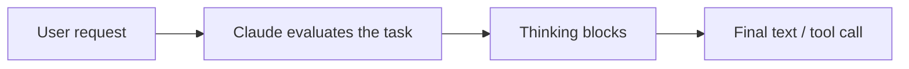
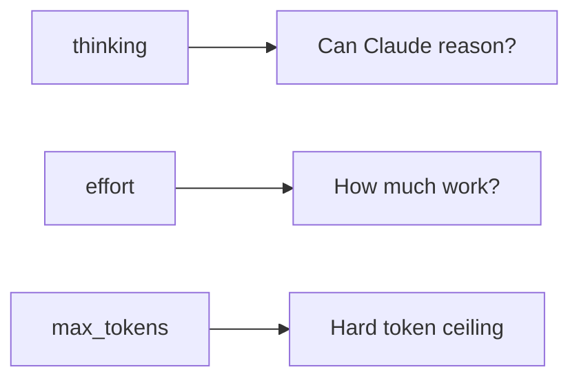
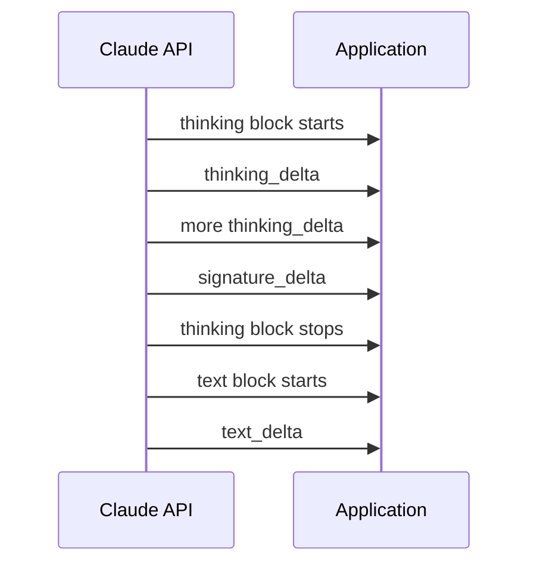
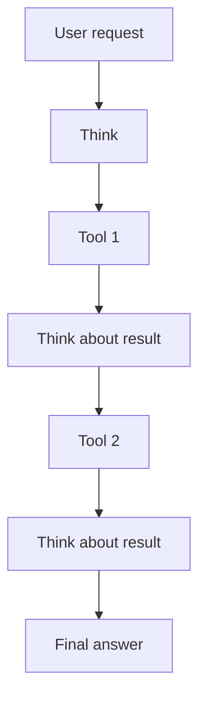
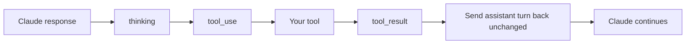
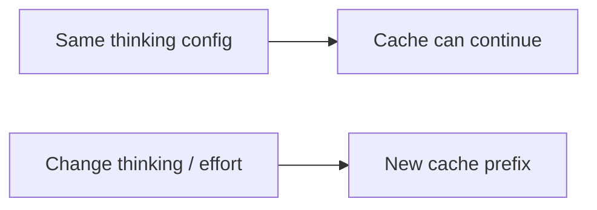
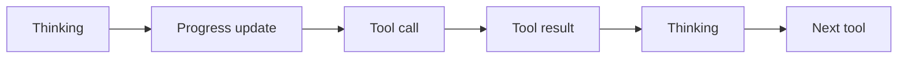
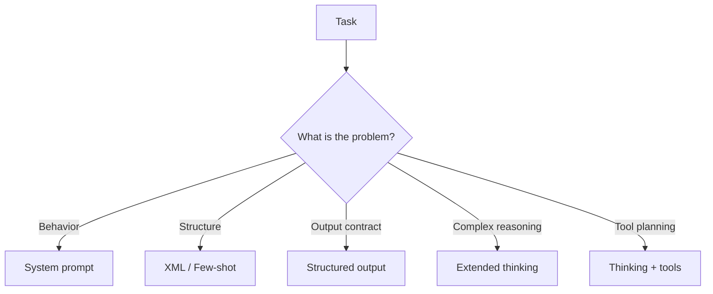
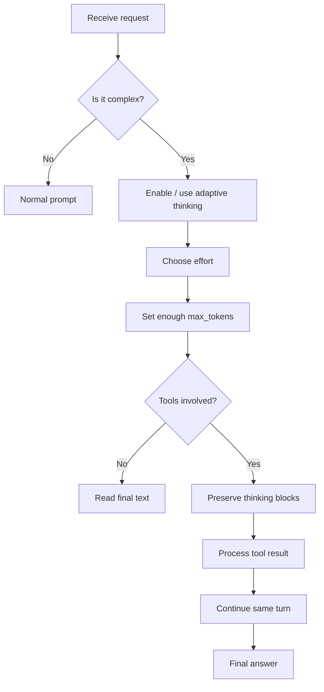

# Claude Extended Thinking

> **Simple idea:** Prompting controls **what Claude does**. Thinking controls **how much work Claude does before answering**.

Extended thinking is useful when a task needs several reasoning steps, checking, planning, or tool decisions. It is usually unnecessary for simple classification, extraction, or formatting.

---

## 1. What Extended Thinking Does

Without thinking:

```text
User request
    ↓
Claude
    ↓
Answer
```

With thinking:



Thinking can help Claude:

- Work through several steps
- Check intermediate results
- Compare possible approaches
- Reconsider a weak approach
- Plan tool calls
- Process tool results before deciding what to do next

The API returns thinking blocks before the final text block. The thinking content you can receive is a **summary**, not the raw private chain of thought.

---

## 2. When Should I Use It?

| Task | Thinking? | Why |
|---|---|---|
| Math derivation | ✅ Yes | Multiple dependent steps |
| Complex debugging | ✅ Yes | Needs investigation and checking |
| Architecture / planning | ✅ Yes | Many constraints must be considered |
| Multi-step agent | ✅ Yes | Helps with tool selection and follow-up decisions |
| Simple classification | ❌ Usually no | A good prompt is enough |
| Field extraction | ❌ Usually no | Little reasoning is needed |
| Format conversion | ❌ Usually no | Extra reasoning adds cost without much value |
| Short factual answer | ❌ Usually no | Usually not worth the extra work |

### Rule

```text
Hard problem + expensive mistakes
        ↓
   Consider thinking

Simple / mechanical task
        ↓
   Keep it simple
```

Thinking tokens are billed as output tokens, so enabling more reasoning has a real cost.

---

## 3. Turning Thinking On

Current Claude models use **adaptive thinking** where supported.

### Python

```python
import anthropic

client = anthropic.Anthropic()

response = client.messages.create(
    model="claude-opus-4-8",
    max_tokens=16000,
    thinking={
        "type": "adaptive",
        "display": "summarized",
    },
    messages=[
        {
            "role": "user",
            "content": "Find the greatest common divisor of 1071 and 462."
        }
    ],
)

for block in response.content:
    if block.type == "thinking":
        print("Thinking:", block.thinking)
    elif block.type == "text":
        print("Answer:", block.text)
```

With adaptive thinking, Claude decides whether and how deeply to think based on the request. On some newer models, thinking is already enabled by default; on others, `thinking={"type": "adaptive"}` enables it. Always check the model's current configuration.

---

## 4. `thinking` vs `effort`

These are different controls.

| Parameter | Controls |
|---|---|
| `thinking` | Whether thinking is available / active |
| `effort` | How much work Claude puts into the overall response |
| `max_tokens` | Hard maximum for generated tokens |

Think of it as:



### Practical tuning

| Goal | What to change |
|---|---|
| Lower cost / latency | Lower `effort` |
| Claude is not thinking deeply enough | Raise `effort` |
| Need a hard spending/output ceiling | Set `max_tokens` |
| Need thinking disabled | Use `thinking: {"type": "disabled"}` where the model supports it |

`effort` is guidance; `max_tokens` is the hard limit. Do not use `"adaptive"` as an `effort` value — adaptive is a thinking mode.

---

## 5. Thinking and `max_tokens`

Thinking tokens count toward `max_tokens`.

```text
max_tokens = 16,000

Thinking       10,000
Final answer    2,000
---------------------
Total           12,000
```

So don't set `max_tokens` only based on the final answer.

```python
response = client.messages.create(
    model="claude-opus-4-8",
    max_tokens=16000,
    thinking={"type": "adaptive"},
    messages=[
        {"role": "user", "content": "Solve this complex problem..."}
    ],
)
```

A request can stop because it reaches the context-window limit. On newer Claude models, this can produce:

```text
stop_reason = "model_context_window_exceeded"
```

---

## 6. Reading Thinking Correctly

A response can contain different block types:

```json
{
  "content": [
    {
      "type": "thinking",
      "thinking": "A summary of the reasoning...",
      "signature": "..."
    },
    {
      "type": "text",
      "text": "The final answer..."
    }
  ]
}
```

### Read the blocks by type

```python
for block in response.content:
    if block.type == "thinking":
        print("Thinking:", block.thinking)

    elif block.type == "text":
        print("Final:", block.text)
```

> **Do not assume the first block is always text.**

Thinking blocks appear before the final answer and can also appear between tool calls.

---

## 7. `display`: What Do I See?

The `display` setting controls what is returned in the thinking block.

| `display` | What you receive | Good for |
|---|---|---|
| `summarized` | Readable summary of thinking | Debugging / prompt development |
| `omitted` | Empty `thinking` field, signature remains | Production apps that do not show thinking |
| `updates` *(beta)* | User-facing progress updates | Agent UIs showing status between tools |

### Important

`"summarized"` does **not** mean raw chain-of-thought.

Claude does not return raw private reasoning through these display modes.

---

## 8. `omitted` vs `summarized`

### Summarized

```json
{
  "type": "thinking",
  "thinking": "Claude considered the constraints and selected..."
}
```

### Omitted

```json
{
  "type": "thinking",
  "thinking": "",
  "signature": "..."
}
```

The important point:

```text
omitted ≠ no thinking
```

Claude can still think. You simply do not receive the readable summary.

Omitting the displayed thinking can improve time-to-first-text-token, but it does **not** remove the thinking cost.

---

## 9. Streaming Thinking

Thinking also works with streaming.



### Python

```python
with client.messages.stream(
    model="claude-opus-4-8",
    max_tokens=16000,
    thinking={
        "type": "adaptive",
        "display": "summarized",
    },
    messages=[
        {
            "role": "user",
            "content": "Solve this complex problem."
        }
    ],
) as stream:

    for event in stream:
        if event.type == "content_block_delta":
            if event.delta.type == "thinking_delta":
                print(event.delta.thinking, end="")

            elif event.delta.type == "text_delta":
                print(event.delta.text, end="")
```

For complete message reconstruction, use the SDK's message accumulation helper rather than manually rebuilding the response from deltas.

---

## 10. Thinking + Tools

This is where thinking becomes especially useful.

Without interleaved thinking:

```text
Think → Tool 1 → Tool 2 → Answer
```

With interleaved thinking:



Claude can reason about a tool result before choosing the next action.

### Example

```text
User:
Find why the deployment failed and check the latest logs.

Claude:
[thinking]
↓
[tool_use: get_deployment]
↓
[tool_result]
↓
[thinking]
↓
[tool_use: get_logs]
↓
[tool_result]
↓
[text: Root cause...]
```

Adaptive thinking supports interleaved thinking automatically on models that support it.

---

## 11. The Carry-Back Rule

This is one of the most important integration rules.

> **When thinking is used with tools, return the thinking blocks exactly as received.**

Do not:

- Edit them
- Summarize them yourself
- Reorder them
- Delete one from the middle
- Rebuild them manually

### Correct flow



### Example

```python
assistant_content = response.content

messages.append({
    "role": "assistant",
    "content": assistant_content,
})

messages.append({
    "role": "user",
    "content": [
        {
            "type": "tool_result",
            "tool_use_id": tool_use_id,
            "content": tool_result,
        }
    ],
})
```

The key is that `assistant_content` must contain the original blocks unchanged.

Modifying a thinking block can cause a `400` error because its signature no longer matches.

---

## 12. Redacted Thinking

Sometimes Claude returns:

```json
{
  "type": "redacted_thinking",
  "data": "..."
}
```

This is encrypted and not readable.

Treat it like another protected thinking block.

### Important

If your code filters like this:

```python
if block.type == "thinking":
    keep(block)
```

you can accidentally drop:

```text
redacted_thinking
```

For tool-use round trips, preserve both:

```python
if block.type in {"thinking", "redacted_thinking"}:
    keep(block)
```

---

## 13. Do Not Change Thinking Mid-Turn

Thinking mode applies to the whole assistant turn.

### ❌ Avoid

```text
User
  ↓
Claude with thinking
  ↓
Tool call
  ↓
Turn thinking off
  ↓
Tool result
```

### ✅ Do

```text
Turn 1
thinking = enabled
    ↓
complete assistant/tool loop

Turn 2
choose the next thinking configuration
```

If thinking is changed during a tool-use turn, the API can disable thinking for that request rather than treating it as a clean configuration change.

> **Choose the thinking strategy at the start of the turn.**

---

## 14. Manual Thinking vs Adaptive Thinking

There are two important modes in the current API.

| Mode | Idea |
|---|---|
| `adaptive` | Claude decides when and how deeply to think |
| `enabled` | Manual extended-thinking configuration for models that support it |
| `disabled` | Turns thinking off where supported |

For current adaptive-capable models, adaptive thinking is generally the simpler choice.

### Manual mode and tools

Manual extended thinking has a tool-choice restriction:

```text
tool_choice = auto   ✅
tool_choice = none   ✅

tool_choice = any    ❌
tool_choice = specific tool  ❌
```

Adaptive thinking supports forced tool use on supported models, with model-specific exceptions.

---

## 15. Turning Thinking Off

Some models have thinking enabled by default but allow it to be disabled.

```python
response = client.messages.create(
    model="claude-sonnet-5",
    max_tokens=4096,
    thinking={"type": "disabled"},
    messages=[
        {
            "role": "user",
            "content": "Summarize this article in one sentence."
        }
    ],
)
```

Model support varies.

> **Always check the current model configuration before relying on `disabled`.**

---

## 16. Thinking and Prompt Caching

Changing thinking configuration can affect prompt caching.

These changes can start a new cache prefix:

- `adaptive` ↔ `enabled` ↔ `disabled`
- Changing `effort`
- Changing `budget_tokens` where applicable



During tool-use loops, thinking blocks can also be cached with tool results.

For long thinking-heavy workflows, a longer cache lifetime can help maintain cache hits.

---

## 17. Thinking and Context Size

Thinking uses context too.

### Current turn

```text
Input
+
Thinking
+
Final answer
=
Current context usage
```

On models that preserve previous thinking:

```text
Turn 1 thinking
      ↓
Turn 2 context
      ↓
Turn 3 context
      ↓
Longer conversation
```

This can increase context usage in long agentic sessions.

Some models keep all prior thinking; others keep only the latest turn and automatically remove older thinking blocks. The exact behavior is model-dependent.

### Practical rule

> **Do not manually delete thinking blocks just to save context unless you understand the preservation rules.**

Use the API's context-management features when possible.

---

## 18. Preserved Thinking and Conversation Changes

Newer models can bind thinking blocks to the conversation that produced them.

Changing earlier history can invalidate later thinking.

Examples:

```text
Edit an earlier message       ❌
Remove an earlier message     ❌
Change top-level system       ❌
Change tools                  ❌
Rewrite old conversation     ❌
```

A safer pattern is:

```text
Append new messages
       ↓
Keep previous history unchanged
       ↓
Claude continues with valid thinking
```

This is why **append-only conversation history** is a useful design pattern.

---

## 19. Prefix Mismatch

If the conversation prefix changed and the thinking block is no longer valid, newer API behavior can reject the request with a `400`.

The beta block-binding controls provide:

```text
prefix_mismatch_behavior = "error"
```

or:

```text
prefix_mismatch_behavior = "drop_block"
```

With the beta controls enabled, dropped thinking blocks can be reported through:

```json
{
  "input_transformations": [
    {
      "type": "thinking_dropped",
      "path": "messages.1.content.0",
      "reason": "prefix_binding_mismatch"
    }
  ]
}
```

For most applications, the simpler solution is still:

> **Keep earlier conversation history unchanged.**

---

## 20. Progress Updates

Some newer models can provide short progress updates between tool calls.

These are different from reasoning.



With:

```python
thinking={
    "type": "adaptive",
    "display": "updates",
}
```

the application can show short status messages while keeping the reasoning itself hidden.

This is a beta feature and requires the appropriate beta header.

---

## 21. Cost and Latency

Thinking is not free.

| Factor | Impact |
|---|---|
| More thinking | More output tokens |
| Higher effort | Potentially more work and latency |
| Larger `max_tokens` | Allows more thinking + answer |
| `display="omitted"` | Can improve first-text latency, but does not remove thinking cost |
| Long thinking sessions | More context usage |
| Tool loops | More reasoning + tool-result processing |

### Simple optimization

```text
Start with reasonable effort
        ↓
Measure quality
        ↓
If too weak → increase effort
        ↓
If too expensive → lower effort
```

Do not automatically use the highest effort for every request.

---

## 22. Extended Thinking vs Prompt Engineering

These solve different problems.

| Problem | Better tool |
|---|---|
| Model does not understand its role | System prompt |
| Instructions and data are mixed | XML |
| Output pattern is inconsistent | Few-shot examples |
| Output must follow a strict schema | Structured outputs |
| Problem needs multi-step reasoning | Extended thinking |
| Agent must plan tool calls | Extended thinking + tools |



> **Thinking is not a replacement for good prompting. Use both when the task needs both.**

---

## 23. Production Example

```python
import anthropic

client = anthropic.Anthropic()

response = client.messages.create(
    model="claude-opus-4-8",
    max_tokens=16000,
    thinking={
        "type": "adaptive",
        "display": "omitted",
    },
    messages=[
        {
            "role": "user",
            "content": """
Analyze this production failure.

Identify:
1. Most likely root cause
2. Evidence
3. Recommended fix

Keep the final answer concise.
"""
        }
    ],
)

for block in response.content:
    if block.type == "text":
        print(block.text)
```

The pattern is:

```text
Clear task
   +
Adaptive thinking
   +
Reasonable effort
   +
Enough max_tokens
   +
Hidden thinking display
   =
Good production pattern
```

---

## 24. Common Mistakes

| Mistake | Better approach |
|---|---|
| Using thinking for every request | Use it for tasks that benefit from deeper reasoning |
| Setting `max_tokens` too low | Leave room for thinking and final output |
| Treating summarized thinking as raw reasoning | It is a summary |
| Dropping thinking blocks during tool use | Return them unchanged |
| Filtering only `thinking` blocks | Preserve `redacted_thinking` too |
| Changing thinking mid-turn | Change it between turns |
| Editing old conversation history | Prefer append-only history |
| Changing effort repeatedly | Remember that it can affect caching |
| Assuming every model has the same defaults | Check model-specific configuration |
| Manually pruning thinking without understanding preservation | Use context-management features |

---

## 25. Mental Model

Remember these five points:

```text
1. Thinking = more work before the answer
2. Effort = how much work Claude puts into the response
3. max_tokens = hard generation limit
4. display = what thinking content your app receives
5. Tool use = preserve thinking blocks exactly
```

### Final workflow



> ## **Remember**
>
> **Use extended thinking when the task benefits from deeper reasoning.**
>
> **Use effort to control how much work Claude does.**
>
> **Use `max_tokens` as the hard ceiling.**
>
> **Use `display` to control what thinking content your application receives.**
>
> **When tools are involved, preserve thinking and redacted-thinking blocks exactly as returned.**
