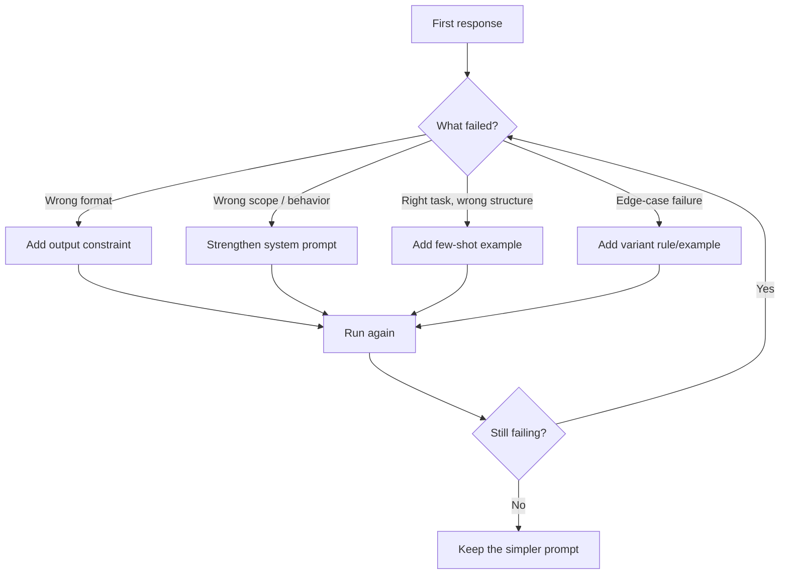
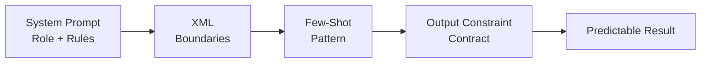
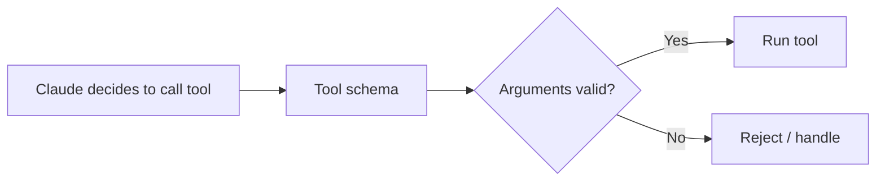
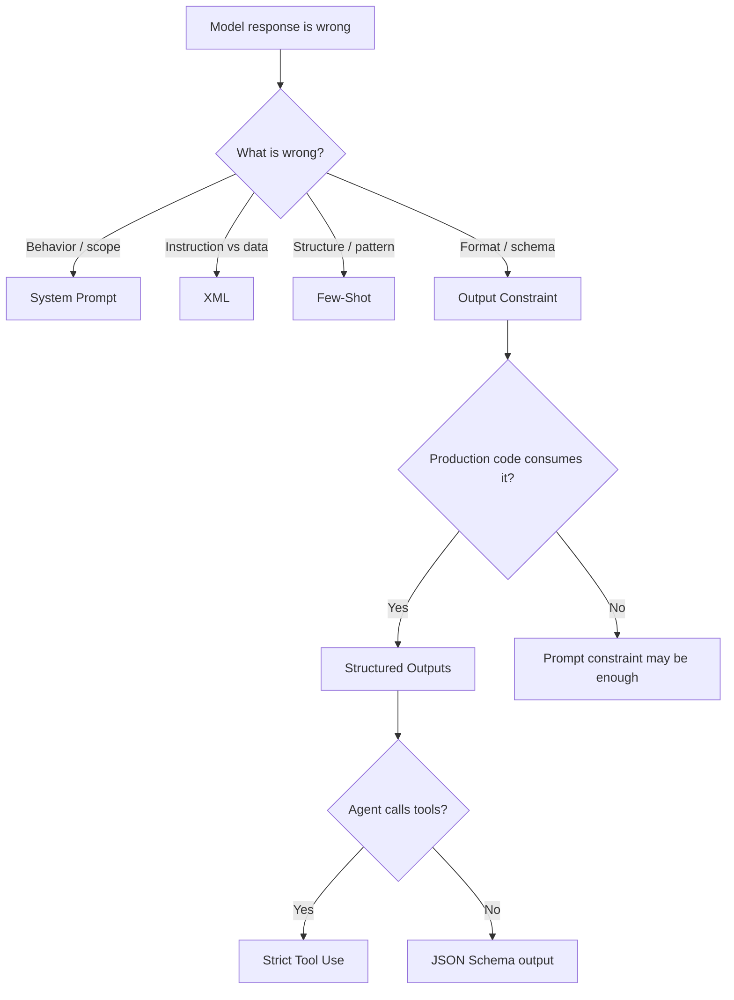

# System Prompts, XML, Few-Shot Examples & Output Constraints

> **Core idea:** When a prompt fails, don't immediately make it longer. First figure out **what actually failed**, then add the technique that addresses that failure.

---

## 1. The Four Techniques

| Technique | What it controls | When I use it |
|---|---|---|
| 🔵 **System Prompt** | Role, behavior, scope, persistent rules | The model is drifting from the task or changing behavior across turns |
| 🔵 **XML Tags** | Boundaries between instructions, data, and examples | I need the model to clearly understand instruction vs. input |
| 🔵 **Few-Shot Examples** | The exact pattern I want | The model understands the task but invents the output structure |
| 🔴 **Output Constraints** | Final response shape | My application needs a predictable label, JSON object, fields, or schema |

### Diagnose first

```text
Wrong format        → Output constraint
Wrong behavior      → System prompt
Wrong structure     → Few-shot example
Edge-case failure   → Add an edge-case constraint/example
```

---

## 2. Diagnose Before Re-Prompting

A common mistake is:

**Prompt fails → add more words → prompt gets longer → output still fails.**

Instead, I use this loop:



> 🔵 **The fix should be structural, not just better wording.**

If the model mixes instructions with input data, use boundaries. If JSON keeps changing shape, use an output contract. If the model understands the task but invents the format, show an example.

---

# 3. System Prompts

A system prompt is the **persistent contract** for the model.

I use it for:

- Role and responsibility
- Scope
- Behavior
- Tone
- Rules that should remain consistent
- High-level response expectations

### Example

```python
system_prompt = (
    "You are a support-ticket classifier. "
    "Classify each ticket into BILLING, TECHNICAL, or ESCALATION. "
    "Stay within the classification task. "
    "Do not explain the classification."
)
```

If the model starts answering a broader question or changes behavior later in the conversation, I strengthen the **system-level contract** instead of endlessly rewriting the user prompt.

---

# 4. XML Tags

XML helps when a prompt contains several kinds of information.

```xml
<instructions>
Classify the support ticket.
Return only the category.
</instructions>

<categories>
BILLING
TECHNICAL
ESCALATION
</categories>

<ticket>
I was charged twice for the same month.
</ticket>
```

Now the model can distinguish:

**instructions → allowed values → actual input**

| Situation | Why XML helps |
|---|---|
| Instructions + user data | Keeps them separate |
| Multiple examples | Makes each example easy to identify |
| Long context | Creates clear sections |
| Nested information | Gives explicit boundaries |

> 🔵 **Think of XML as a labeling and boundary mechanism.**

---

# 5. Few-Shot Examples

Sometimes explaining the desired format is not enough. I show the model what a correct answer looks like.

### Example

```xml
<example>
  <input>My account shows two charges for April.</input>
  <output>BILLING</output>
</example>

<example>
  <input>The API keeps returning HTTP 429.</input>
  <output>TECHNICAL</output>
</example>

<ticket>
I was charged twice for the same month.
</ticket>
```

The examples establish the:

- Exact label
- Capitalization
- Output shape
- Amount of information to return

**One good example can communicate more clearly than several lines of explanation.**

---

# 6. Output Constraints

I use an output constraint when **another program depends on the response shape**.

For example, my router may expect:

```text
BILLING
```

and not:

```text
This looks like a billing issue.
```

### Basic constraint

```text
Classify the ticket into exactly one of:
BILLING, TECHNICAL, ESCALATION.

Return only the category.
Do not add an explanation.
```

For production output, I should define:

- **Field names**
- **Types**
- **Allowed values**
- **Required/optional fields**
- **Length limits**
- **Missing-data behavior**
- **Whether a preamble is allowed**
- **Where the response should stop**

> 🔴 **If code consumes the response, treat the output format as an API contract.**

---

# 7. Worked Example — Classification

## ❌ First Version

```text
System:
You are a support classifier. Classify the ticket.

User:
<ticket>I was charged twice for the same month.</ticket>
```

Possible results:

```text
Billing
billing
This looks like a billing issue.
```

The model understands the task, but the downstream router expects one fixed value.

### Diagnosis

| Observation | What it tells me |
|---|---|
| Correct category | Task understanding is fine |
| Different casing | Output is not constrained |
| Sometimes a sentence | Output boundary is missing |
| Router rejects it | Production contract is not stable |

**Missing piece → Output constraint**

## ✅ Improved Version

```text
System:
You are a support classifier.

Classify each ticket into exactly one of:
BILLING
TECHNICAL
ESCALATION

Return only the label. No explanation.

<sample_input>
My account shows two charges for April.
</sample_input>

<ideal_output>
BILLING
</ideal_output>

<sample_input>
The API keeps returning a 429 error.
</sample_input>

<ideal_output>
TECHNICAL
</ideal_output>

User:
<ticket>
I was charged twice for the same month.
</ticket>
```

### What each technique does

| Technique | Job |
|---|---|
| **System prompt** | Defines the classifier and behavior |
| **XML** | Separates examples and input |
| **Few-shot** | Shows exact casing and pattern |
| **Output constraint** | Prevents extra text |

Expected result:

```text
BILLING
```

---

# 8. When Should I Stack the Techniques?



Use all four when the workflow genuinely needs them.

For a simple task such as:

```text
Summarize this paragraph in two sentences.
```

I don't need a complicated schema and several examples.

> **Use the smallest structure that solves the actual problem.**

---

# 9. Edge Cases

A prompt can work perfectly during testing and still fail in production.

Example:

```text
"The customer was charged twice, but the API also returns a 429."
```

If my application has a defined rule for this situation, that rule belongs in the prompt or in an example.

```text
If a ticket contains both billing and technical symptoms,
classify it as BILLING unless the customer explicitly asks
for technical troubleshooting.
```

> 🔴 **If production can send it, test it.**

A prompt that only handles the happy path is not finished.

---

# 10. Structured Outputs — Move the Contract Into the API

Prompt instructions are useful, but they are still instructions.

For production workflows where the response must match a schema, structured outputs provide a stronger mechanism.

Instead of:

```text
Please return JSON with these fields.
```

I define the expected schema through the API.


| Prompt-only | Structured output |
|---|---|
| Model is instructed to follow a format | API constrains generation to the schema |
| Application may need parsing/retry logic | Less manual format-repair work |
| Edge cases can produce malformed output | Schema validity is enforced during generation |

---

# 11. JSON Outputs

Use structured JSON when the **final model response is consumed by code**.

Example:

```json
{
  "category": "BILLING",
  "confidence": 0.98,
  "reason": "Duplicate charge detected"
}
```

The source material describes configuring:

```text
output_config.format
type = json_schema
```

The important part is that I provide the schema rather than relying only on natural-language instructions.

---

# 12. Strict Tool Use

In an agentic workflow, I may also need to control the **arguments sent to tools**.

```python
tool = {
    "name": "create_ticket",
    "strict": True,
    "input_schema": {
        "type": "object",
        "properties": {
            "title": {"type": "string"},
            "priority": {
                "type": "string",
                "enum": ["LOW", "MEDIUM", "HIGH"]
            }
        },
        "required": ["title", "priority"]
    }
}
```

The flow becomes:



This is useful when malformed arguments could crash a function or cause an unintended action.

---

# 13. Prompt Engineering and Evaluation

I should not stop at **“it worked once.”**

Test the prompt against:

- Normal inputs
- Boundary cases
- Missing fields
- Unexpected values
- Long inputs
- Conflicting information
- Output-format violations


# 14. Production Trade-offs

Structured generation improves reliability, but there are still costs and failure cases.

| Consideration | What I need to remember |
|---|---|
| 🟡 **First-request latency** | A new schema has compilation overhead. |
| 🟡 **Schema caching** | Compiled grammars are cached for 24 hours from last use. |
| 🟡 **Input tokens** | Format-related system instructions increase input-token usage. |
| 🔴 **Refusal** | A safety refusal can return `stop_reason = refusal`. |
| 🔴 **Truncation** | Hitting `max_tokens` can stop generation before the structure is complete. |
| 🔴 **Prefilling conflict** | JSON outputs and assistant-message prefilling cannot be combined in the same request. |

### Production check

Don't blindly assume:

```python
response = call_model()
data = parse(response)
```

Check the outcome first:

```python
if stop_reason == "refusal":
    handle_refusal()

elif stop_reason == "max_tokens":
    handle_truncation()

else:
    process_structured_response()
```

> **Schema validation does not mean the request itself succeeded.**

---

# 15. Quick Decision Guide



---

# 16. Final Takeaways

### 🔵 System Prompt
**Controls behavior and scope across the conversation.**

### 🔵 XML
**Makes boundaries between different parts of the prompt obvious.**

### 🔵 Few-Shot
**Shows the model the exact pattern when words alone are not enough.**

### 🔴 Output Constraints
**Defines the response contract expected by the application.**

### 🔴 Structured Outputs
**Moves schema enforcement closer to generation for production use.**

### 🔴 Strict Tool Use
**Keeps tool arguments aligned with the tool's schema.**

---

> ## **The rule I would remember**
>
> **Don't keep making the prompt longer.**
>
> **Diagnose the failure first.**
>
> **Add the missing structural control.**
>
> **Then test it against the cases that can actually break production.**

---

# 17. The Prompt That Grew Longer Instead of Better

> **Key idea:** If a prompt keeps failing, don't keep adding words. Identify the missing constraint and fix that directly.

## Six Revision Passes

| Pass | What was added | Wrong prompt | Output behavior | Better / fixed prompt |
|---|---|---|---|---|
| **1** | Basic classification instruction | `Classify this ticket as billing, technical, or escalation.` | Returns a sentence such as *"This appears to be a billing issue."* | `Classify this ticket into exactly one of: BILLING, TECHNICAL, ESCALATION. Return only the label.` |
| **2** | Added *"Be concise"* and *"Use only the category name"* | `Be concise. Use only the category name.` | Returns `Billing` or `billing`; case varies. | `Return exactly one value: BILLING, TECHNICAL, or ESCALATION. Use uppercase only.` |
| **3** | Added long category descriptions | Several paragraphs explaining billing, technical, and escalation | Simple cases work, but ambiguous tickets may return `BILLING / TECHNICAL`. | Keep definitions short and add: `Return exactly one category. Never return multiple labels.` |
| **4** | Added ambiguity rules | `Never return two categories. If ambiguous, choose the most likely one.` | Better, but some ambiguous tickets still return explanations. | Add a direct output contract: `Return only one label. No explanation or extra text.` |
| **5** | Added more edge-case rules and reminders | Long prompt with repeated rules such as *"Be precise"*, *"Do not explain"*, *"Choose the best category"* | Prompt becomes verbose; output may also become verbose. Latency increases without meaningful accuracy gain. | Remove repeated instructions. Keep one precise rule and add one ambiguous few-shot example. |
| **6** | Replaced verbose instructions with an exact constraint + examples | Long descriptive prompt | Output becomes stable and parser-friendly. | Use a short system rule + few-shot examples + exact output format. |

## Final Fixed Prompt

**System prompt**

```text
You are a support classifier.

Classify each ticket into exactly one of:
BILLING
TECHNICAL
ESCALATION

Return only the label.
No other text.
```

**Few-shot examples**

```xml
<sample_input>
My account shows two charges for April.
</sample_input>

<ideal_output>
BILLING
</ideal_output>

<sample_input>
The API keeps returning a 429 error.
</sample_input>

<ideal_output>
TECHNICAL
</ideal_output>
```

**User input**

```xml
<ticket>
I was charged twice for the same month.
</ticket>
```

**Expected output**

```text
BILLING
```

## What Went Wrong?

| Failure | What happened | Fix |
|---|---|---|
| **Diagnostic failure** | More description was added, but the missing issue was output control. | Add an exact output constraint. |
| **Engineering failure** | The prompt became longer and slower without improving accuracy. | Remove repeated instructions and use few-shot examples instead. |

